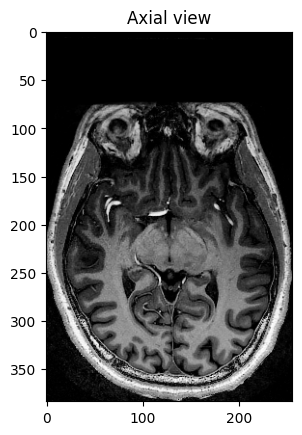
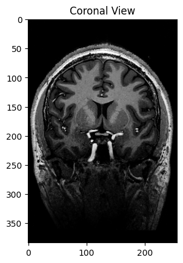
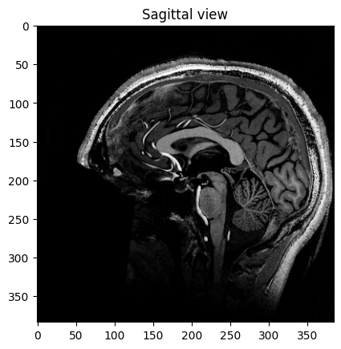

# Week 2 Assignment
DICOM and NIfTI files are in `Sample_Data` folder
## Approach:
### Loading Data:
1. Used nibabel and simpleitk to load NIfTI file.
2. Used pydicom to load DICOM file.
### Exploring Data:
1. Checked metadata of both files
2. Checked Affine Matrix of NIfTI file.
### DICOM slices to 3D volume:
1. Sorted DICOM files
2. Converted to numpy array and stacked them
### Visualization:
Plotted middle slice of each view of NIfTI file.

## Observations and Challenges:
### NIfTI:
1. Transformation from voxels to real world coordinates.
2. No. of voxels in NIfTI file
3. Data Structure: Fields, datatype, and shape
4. Difference in syntax of simpleitk and nibabel
### DICOM:
1. Different Metadata values stored in file.
2. How to stack slices to convert to 3D volume.
### Challenges:
1. Difficult to find DICOM dataset having complete metadata information. (Found current dataset from https://zenodo.org/records/16956)
2. simpleitk syntax for metadata of DICOM was quite complex therefore only used pydicom.
